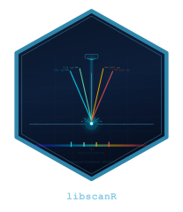

# libscanR 

<!-- badges: start -->
[](https://github.com/r-heller/libscanR/actions/workflows/R-CMD-check.yaml)
[](https://app.codecov.io/gh/r-heller/libscanR)
[](https://lifecycle.r-lib.org/articles/stages.html#experimental)
<!-- badges: end -->

Vendor-agnostic analysis and visualization of
**Laser-Induced Breakdown Spectroscopy (LIBS)** data in R, with a focus on
biomedical tissue applications.

## Features

- **Import**: Generic CSV/TSV/TXT, SciAps Z-series, Applied Spectra J200/Aurora,
  auto-detection.
- **Preprocessing**: SNIP/ALS baseline correction, five normalization modes,
  Savitzky-Golay / Gaussian / moving-average / median smoothing, shot averaging
  with outlier removal, wavelength cropping, gate delay optimization.
- **Peak analysis**: SNR+prominence peak detection; identification against a
  curated NIST emission-line database (23 biomedically relevant elements).
- **Calibration**: Univariate, internal-standard, PLS, and calibration-free
  LIBS (Saha-Boltzmann). LOD / LOQ with 3σ / 10σ criteria.
- **Chemometrics**: PCA, PLS-DA, k-means / hierarchical clustering,
  SVM / Random-Forest classifiers.
- **Tissue analysis**: Rule-based tissue classification using elemental
  ratios; discriminating-line analysis with FDR correction.
- **Spatial mapping**: Single-element and multi-element 2-D maps from
  raster-scan datasets.
- **Visualization**: Publication-ready ggplot2 plots; custom
  `theme_libs()` and wavelength color scale.
- **Shiny app**: Six-tab interactive explorer (`ls_run_app()`).
- **Reproducible examples**: `ls_example_data()` provides synthetic
  tissue, calibration, and spatial datasets — no instrument data required.

## Installation

```r
# install.packages("remotes")
remotes::install_github("r-heller/libscanR")
```

## Quick start

```r
library(libscanR)

# Generate a synthetic spectrum
spec <- ls_simulate_spectrum(
  elements = c(Ca = 5000, Na = 1000, Fe = 200),
  seed = 1
)

# Preprocess: baseline, smooth, normalize
spec_proc <- spec |>
  ls_baseline(method = "snip") |>
  ls_smooth(method = "moving_avg", window = 5) |>
  ls_normalize(method = "total")

# Detect and identify peaks
peaks <- ls_find_peaks(spec_proc)
id <- ls_identify_peaks(peaks, elements = c("Ca", "Na", "Fe"))

# Plot with element annotation
ls_plot_spectrum(spec_proc, show_elements = c("Ca", "Na"))

# Launch the interactive app
ls_run_app(data = ls_example_data("tissue"))
```

## Workflow vignettes

- `vignette("getting-started", package = "libscanR")`
- `vignette("preprocessing-workflow", package = "libscanR")`
- `vignette("calibration-quantification", package = "libscanR")`
- `vignette("tissue-classification", package = "libscanR")`
- `vignette("spatial-mapping", package = "libscanR")`

## Citation

```r
citation("libscanR")
```

## License

MIT © Raban Heller
