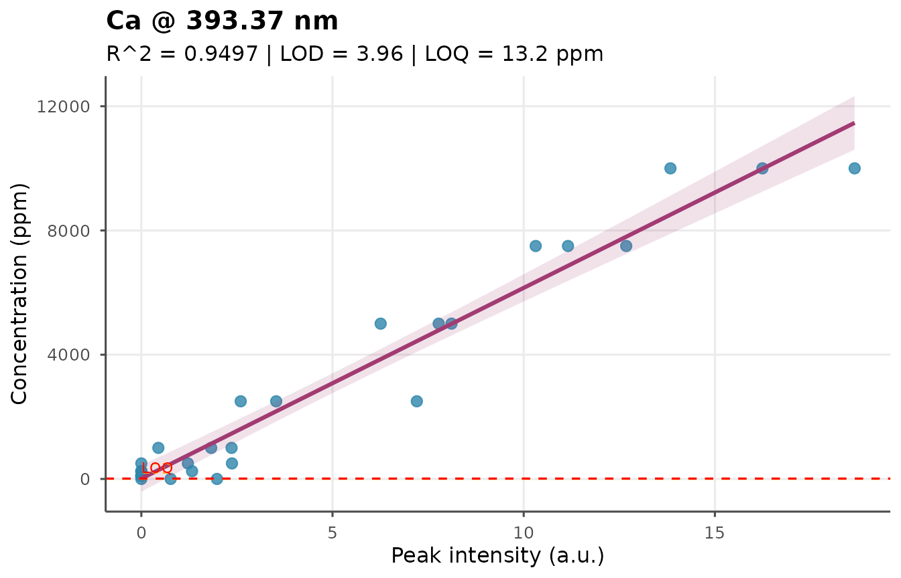
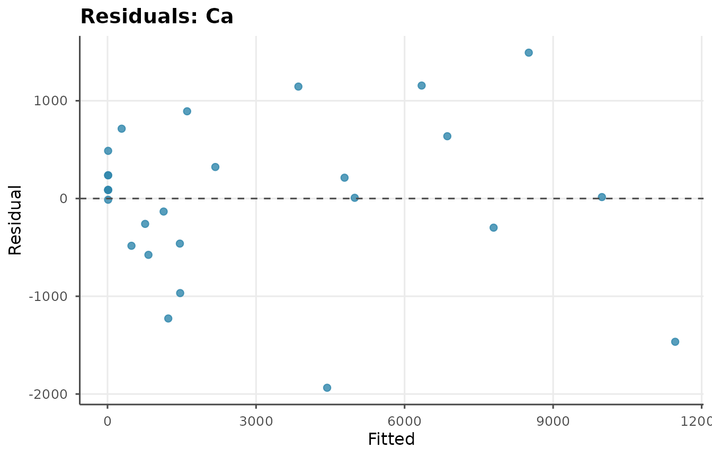

# Calibration and Quantification

``` r
library(libscanR)
```

## From peak area to concentration

A LIBS calibration converts measured peak area (or intensity ratio) to
elemental concentration using a set of matrix-matched standards.

### Synthetic calibration dataset

``` r
cal_ds <- ls_example_data("calibration")
cal_ds
conc <- cal_ds$sample_info$concentration
unique(conc)
#> [1]     0   100   250   500  1000  2500  5000  7500 10000
```

### Univariate calibration

``` r
cal <- ls_calibrate(cal_ds, element = "Ca", line_nm = 393.37,
                    concentrations = conc, method = "univariate",
                    verbose = FALSE)
cal
```

### Visualize

``` r
ls_plot_calibration(cal)
```



### Residual diagnostics

``` r
ls_plot_residuals(cal)
```



### Internal standard calibration

When matrix effects are significant, normalize to a reference line:

``` r
cal_is <- ls_calibrate(cal_ds, "Ca", 393.37, concentrations = conc,
                       method = "internal_std",
                       internal_std_nm = 589.00,
                       verbose = FALSE)
cal_is
```

### PLS calibration

``` r
cal_pls <- ls_calibrate(cal_ds, "Ca", 393.37, concentrations = conc,
                        method = "pls", n_components = 5,
                        verbose = FALSE)
cal_pls
```

## Quantifying unknowns

``` r
ls_quantify(cal, cal_ds)
#> # A tibble: 27 × 6
#>    sample_id    element concentration unit  below_lod below_loq
#>    <chr>        <chr>           <dbl> <chr> <lgl>     <lgl>    
#>  1 std_00000_r1 Ca             1227.  ppm   FALSE     FALSE    
#>  2 std_00000_r2 Ca               12.3 ppm   FALSE     TRUE     
#>  3 std_00000_r3 Ca              483.  ppm   FALSE     FALSE    
#>  4 std_00100_r1 Ca               12.3 ppm   FALSE     TRUE     
#>  5 std_00100_r2 Ca               12.3 ppm   FALSE     TRUE     
#>  6 std_00100_r3 Ca               12.3 ppm   FALSE     TRUE     
#>  7 std_00250_r1 Ca               12.3 ppm   FALSE     TRUE     
#>  8 std_00250_r2 Ca              826.  ppm   FALSE     FALSE    
#>  9 std_00250_r3 Ca               12.3 ppm   FALSE     TRUE     
#> 10 std_00500_r1 Ca             1467.  ppm   FALSE     FALSE    
#> # ℹ 17 more rows
```

## LOD and LOQ

``` r
ls_lod(cal)
#> [1] 3.957456
ls_loq(cal)
#> [1] 13.19152
```

## Calibration-free LIBS (CF-LIBS)

For semi-quantitative estimates without standards, use the
Saha-Boltzmann method:

``` r
spec <- ls_simulate_spectrum(
  elements = c(Ca = 10000, Fe = 500, Na = 2000),
  n_channels = 2048, seed = 7
)
spec <- ls_baseline(spec, method = "snip", iterations = 60)
ls_saha_boltzmann(
  spec, elements = c("Ca", "Fe"),
  lines_nm = list(
    Ca = c(422.673, 445.478, 487.813),
    Fe = c(371.994, 404.581, 438.354)
  ),
  verbose = FALSE
)
#> # A tibble: 2 × 6
#>   element temperature_k concentration_rel electron_density n_lines r_squared
#>   <chr>           <dbl>             <dbl>            <dbl>   <int>     <dbl>
#> 1 Ca           -113215.             0.595             1e17       3     0.993
#> 2 Fe             53153.             0.405             1e17       3     0.144
```
