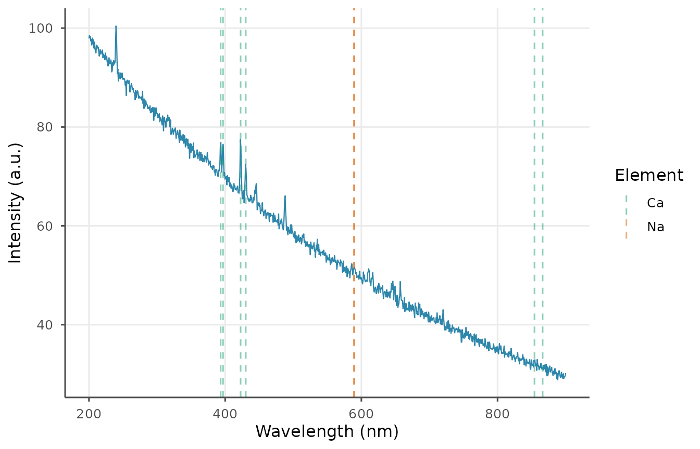
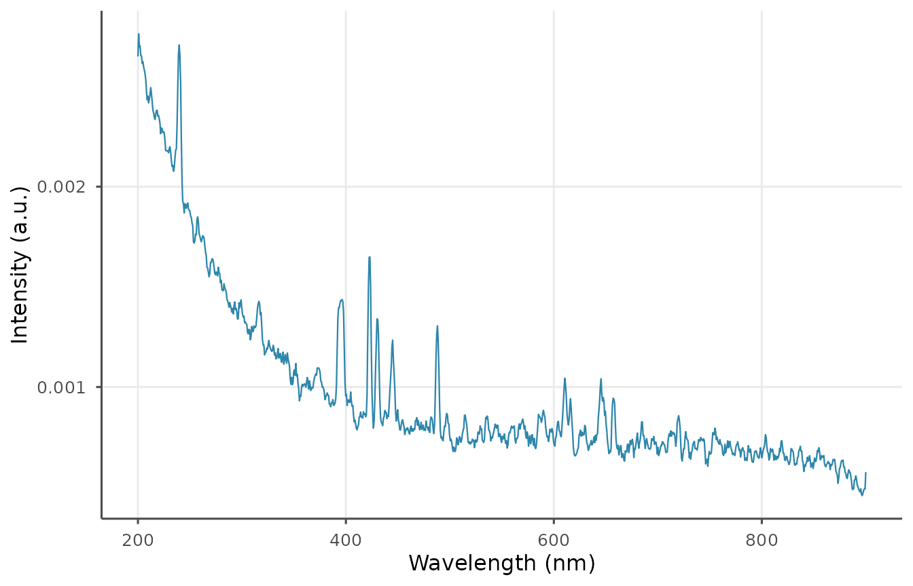

# Getting Started with libscanR

``` r
library(libscanR)
```

## What is libscanR?

`libscanR` provides a vendor-agnostic pipeline for Laser-Induced
Breakdown Spectroscopy (LIBS) data, including import, preprocessing,
peak detection, calibration, quantification, chemometrics, spatial
mapping, and visualization. It ships with a curated NIST emission line
database and example datasets so every feature is runnable without real
instrument data.

## Core data structures

`libscanR` defines three S3 classes:

- `libs_spectrum` — a single spectrum (possibly multi-shot).
- `libs_dataset` — a collection of spectra sharing a wavelength axis.
- `libs_calibration` — a fitted calibration model.

## A 5-minute tour

### Simulate a spectrum

``` r
spec <- ls_simulate_spectrum(
  elements = c(Ca = 5000, Na = 1000, Fe = 200),
  n_channels = 1024,
  seed = 1
)
spec
#> <libs_spectrum>
#> • Range: 200-900 nm (1024 channels)
#> • Shots: 10
#> • Sample: "simulated" (synthetic)
#> • Baseline corrected: FALSE
```

### Plot it

``` r
ls_plot_spectrum(spec, show_elements = c("Ca", "Na"))
```



### Preprocess: baseline, smooth, normalize

``` r
spec_proc <- spec |>
  ls_baseline(method = "snip", iterations = 40) |>
  ls_smooth(method = "moving_avg", window = 5) |>
  ls_normalize(method = "total")
ls_plot_spectrum(spec_proc)
```



### Detect and identify peaks

``` r
peaks <- ls_find_peaks(spec_proc, snr_threshold = 3)
id <- ls_identify_peaks(peaks, elements = c("Ca", "Na", "Fe"))
head(id[, c("wavelength_nm", "element", "ionization", "nist_aki", "confidence")])
#> # A tibble: 6 × 5
#>   wavelength_nm element ionization nist_aki confidence
#>           <dbl> <chr>        <int>    <dbl>      <dbl>
#> 1          201. NA              NA    NA        NA    
#> 2          240. Ca               1     1.87      0.134
#> 3          212. NA              NA    NA        NA    
#> 4          218. NA              NA    NA        NA    
#> 5          223. NA              NA    NA        NA    
#> 6          231. NA              NA    NA        NA
```

### Read from a file

``` r
tmp <- tempfile(fileext = ".csv")
utils::write.csv(
  data.frame(wavelength = spec$wavelength,
             intensity = colMeans(spec$intensity)),
  tmp, row.names = FALSE
)
spec_in <- ls_read_spectrum(tmp, verbose = FALSE)
unlink(tmp)
spec_in
#> <libs_spectrum>
#> • Range: 200-900 nm (1024 channels)
#> • Shots: 1
#> • Sample: "file204e33286393"
#> • Baseline corrected: FALSE
```

### Use example datasets

``` r
ds <- ls_example_data("tissue")
summary(ds)
#> <libs_dataset> summary
#> • Spectra: 50
#> • Channels: 1024
#> • Range: 200-900 nm
#> ℹ Group counts (column "material"):
#>  material  n
#>      bone 10
#>       fat 10
#>    kidney 10
#>     liver 10
#>    muscle 10
#> ℹ Per-spectrum max intensity: median = 103.79, range =
#> 94.1-643.47
```

## Next steps

- [`vignette("preprocessing-workflow", package = "libscanR")`](https://r-heller.github.io/libscanR/articles/preprocessing-workflow.md)
- [`vignette("calibration-quantification", package = "libscanR")`](https://r-heller.github.io/libscanR/articles/calibration-quantification.md)
- [`vignette("tissue-classification", package = "libscanR")`](https://r-heller.github.io/libscanR/articles/tissue-classification.md)
- [`vignette("spatial-mapping", package = "libscanR")`](https://r-heller.github.io/libscanR/articles/spatial-mapping.md)
