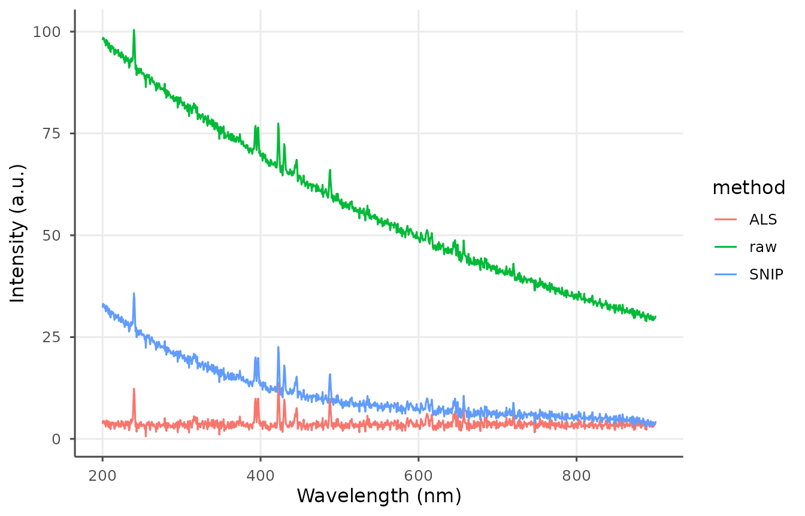
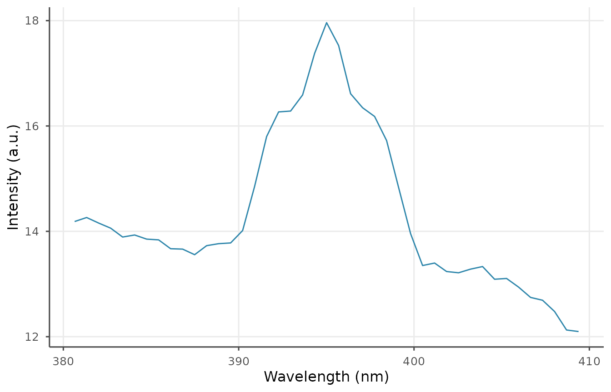
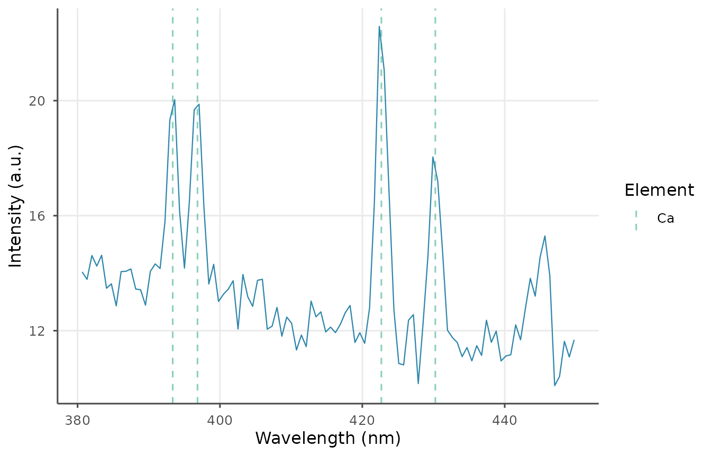
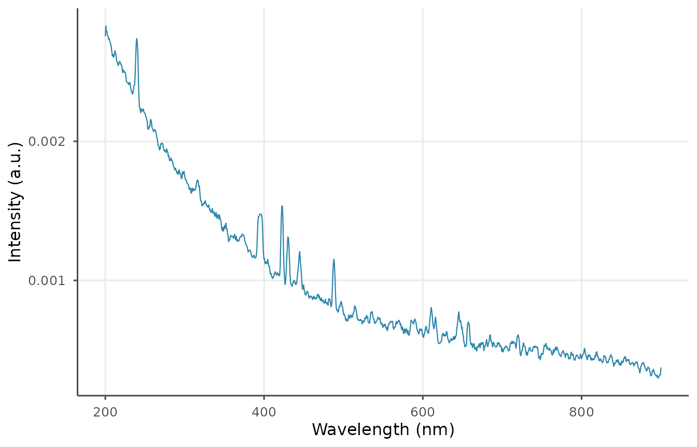

# Preprocessing Workflow

``` r

library(libscanR)
```

LIBS spectra typically contain a continuum background, electronic noise,
and shot-to-shot intensity variation. `libscanR` provides chainable
preprocessing primitives: baseline correction, normalization, smoothing,
cropping, and shot averaging.

## Baseline correction

Four methods are supported: `snip`, `als`, `rolling_ball`, `linear`,
`polynomial`. SNIP and ALS are the workhorses for LIBS continuum
removal.

``` r

spec <- ls_simulate_spectrum(
  elements = c(Ca = 5000, Na = 1000, K = 800, Fe = 200),
  n_channels = 1024, seed = 1
)
snip <- ls_baseline(spec, method = "snip", iterations = 60)
als  <- ls_baseline(spec, method = "als", iterations = 10, lambda = 1e5)

df <- rbind(
  data.frame(w = spec$wavelength,
             y = libscanR:::.mean_intensity(spec),
             method = "raw"),
  data.frame(w = spec$wavelength,
             y = libscanR:::.mean_intensity(snip),
             method = "SNIP"),
  data.frame(w = spec$wavelength,
             y = libscanR:::.mean_intensity(als),
             method = "ALS")
)
ggplot2::ggplot(df, ggplot2::aes(w, y, colour = method)) +
  ggplot2::geom_line() + theme_libs() +
  ggplot2::labs(x = "Wavelength (nm)", y = "Intensity (a.u.)")
```



## Normalization

Five options:

``` r

norm_total <- ls_normalize(snip, method = "total")
cat("sum after total normalization:",
    round(sum(norm_total$intensity[1, ]), 2), "\n")
#> sum after total normalization: 1

norm_is <- ls_normalize(snip, method = "internal_std", ref_wavelength = 589)
```

## Smoothing

``` r

sm <- ls_smooth(snip, method = "moving_avg", window = 7)
ls_plot_region(sm, 380, 410)
```



## Averaging replicate shots with outlier removal

``` r

multi <- ls_simulate_spectrum(seed = 1, n_channels = 512, n_shots = 20,
                              noise_level = 0.05)
avg <- ls_average_shots(multi, remove_outliers = TRUE)
avg$n_shots
#> [1] 1
```

## Cropping

``` r

ca_region <- ls_crop(snip, 380, 450)
ls_plot_spectrum(ca_region, show_elements = "Ca")
```



## Recommended pipeline

``` r

processed <- spec |>
  ls_baseline(method = "snip", iterations = 60) |>
  ls_smooth(method = "moving_avg", window = 5) |>
  ls_normalize(method = "total")
ls_plot_spectrum(processed)
```


