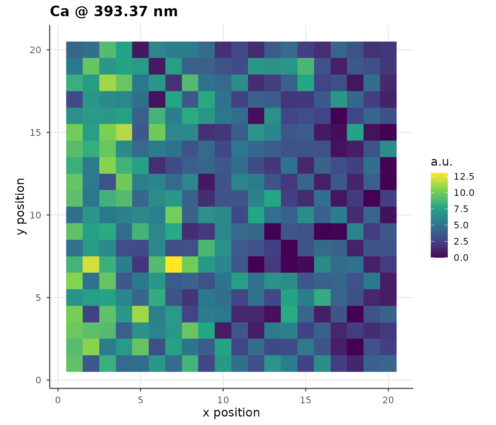
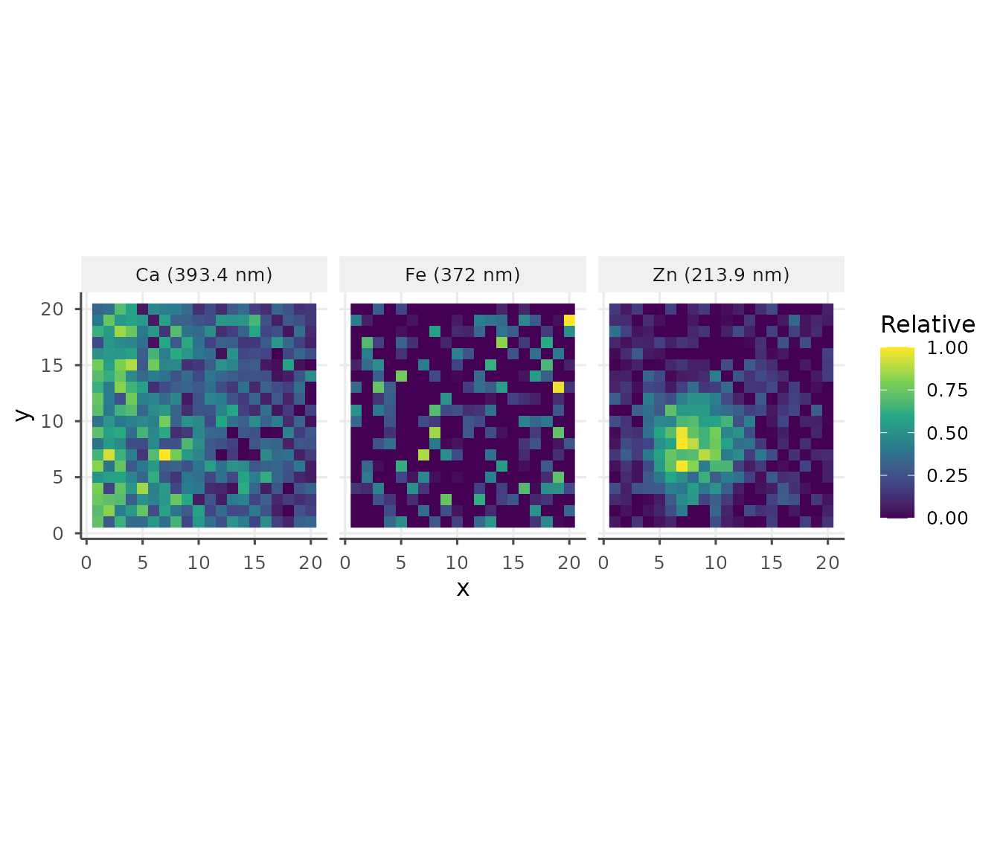
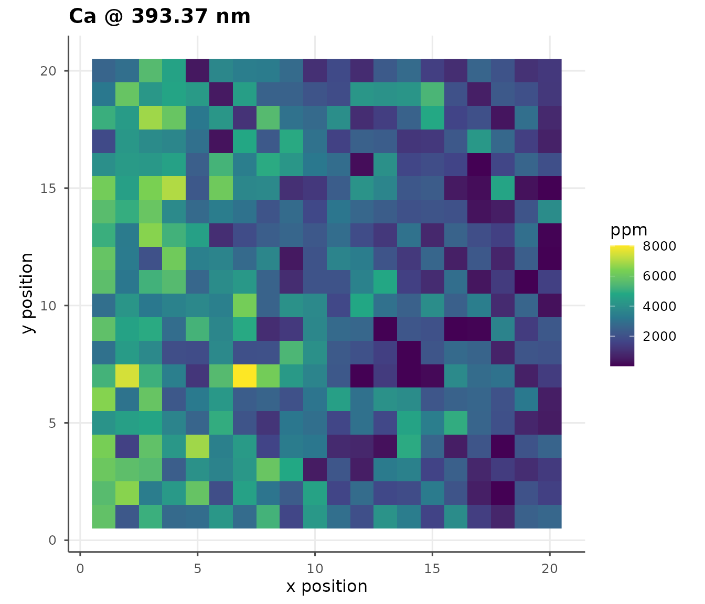

# Spatial Elemental Mapping

``` r
library(libscanR)
```

## Raster scan dataset

``` r
ds <- ls_example_data("spatial")
ds
```

The simulated tissue section has:

- A left-to-right **Ca** gradient (decreasing)
- A top-to-bottom **Fe** gradient (increasing)
- A **Zn**-enriched hotspot simulating a tumor region

## Build a single elemental map

``` r
m_ca <- ls_build_map(ds, "Ca", 393.37)
ls_plot_map(m_ca)
```



## Multi-element panel

``` r
maps <- ls_map_elements(ds, c("Ca", "Fe", "Zn"),
                        c(Ca = 393.37, Fe = 371.99, Zn = 213.86))
ls_plot_map_panel(maps)
```



## Applying a calibration to the map

``` r
cal_ds <- ls_example_data("calibration")
cal <- ls_calibrate(cal_ds, "Ca", 393.37,
                    concentrations = cal_ds$sample_info$concentration,
                    verbose = FALSE)
m_cal <- ls_build_map(ds, "Ca", 393.37, calibration = cal)
ls_plot_map(m_cal)
```



## Hotspot detection

``` r
zn <- ls_build_map(ds, "Zn", 213.86)
hot_idx <- which(zn$values > stats::quantile(zn$values, 0.9))
head(data.frame(x = zn$x[hot_idx],
                y = zn$y[hot_idx],
                zn = round(zn$values[hot_idx], 1)))
#>    x y   zn
#> 1  8 3  9.5
#> 2  8 4  9.9
#> 3 10 4  9.1
#> 4  6 5 10.7
#> 5  9 5 11.3
#> 6  5 6  9.8
```
