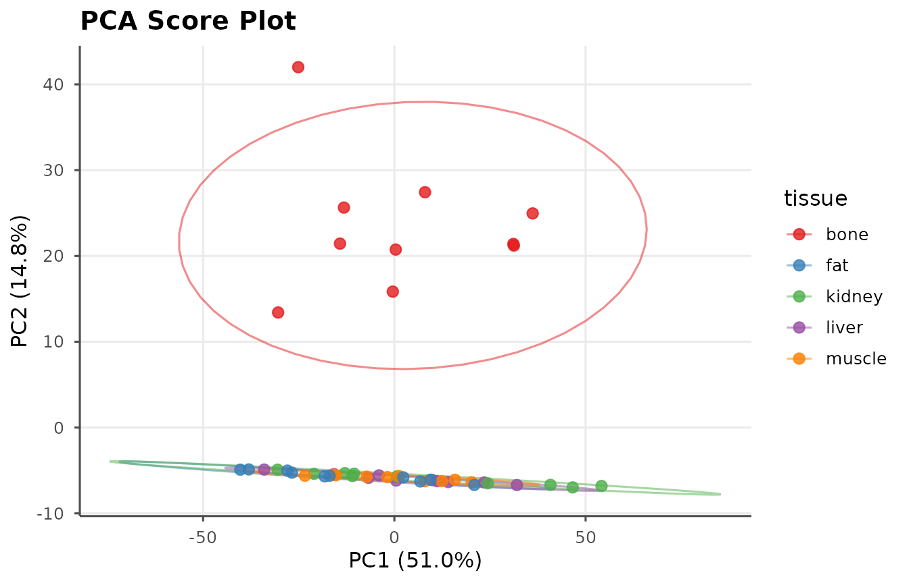
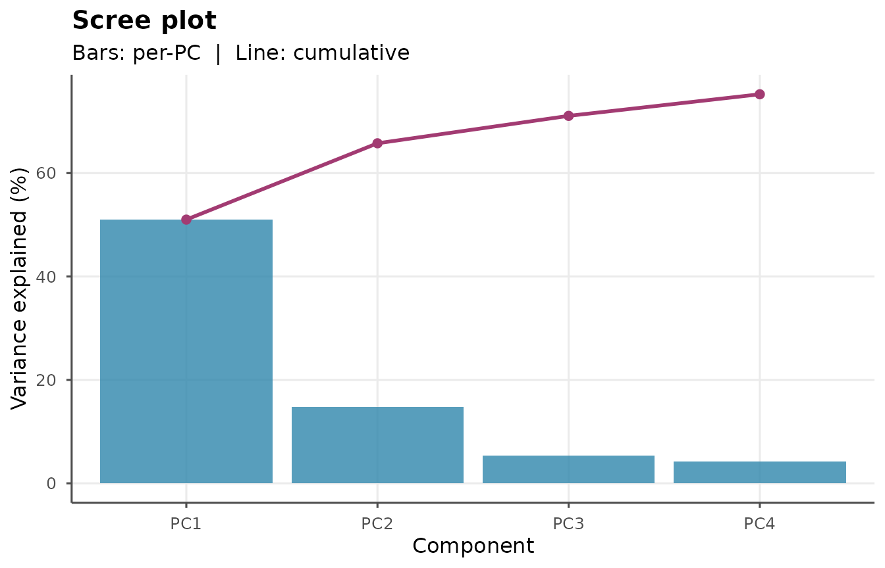
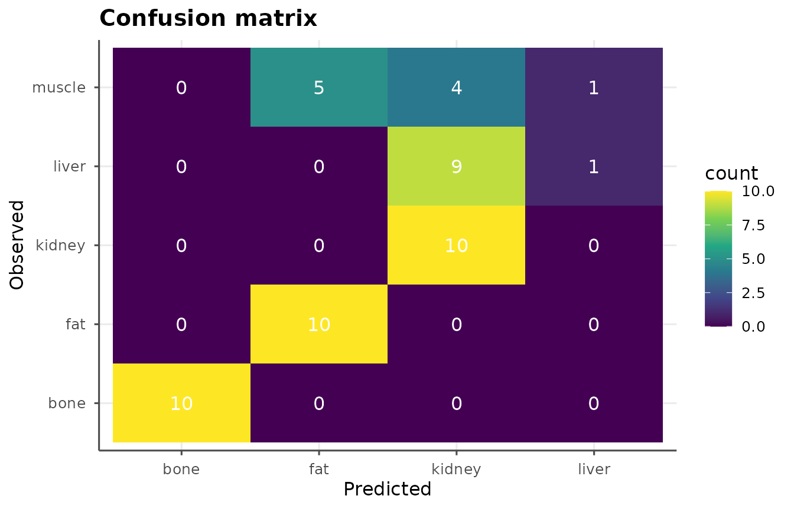

# Tissue Classification

``` r

library(libscanR)
```

## Example: 5 simulated tissue types

``` r

ds <- ls_example_data("tissue")
table(ds$sample_info$tissue)
#> 
#>   bone    fat kidney  liver muscle 
#>     10     10     10     10     10
```

## Exploratory analysis with PCA

``` r

pca <- ls_pca(ds, n_components = 4)
ls_plot_pca(pca, color_by = "tissue")
```



``` r

ls_plot_scree(pca)
```



## Identifying discriminating elements

``` r

d <- ls_tissue_discriminate(ds, "tissue",
                            group_a = "bone",
                            group_b = "muscle")
head(d[!is.na(d$element) & d$significant, c("wavelength_nm",
                                            "element",
                                            "fold_change",
                                            "fdr")], 15)
#> # A tibble: 13 × 4
#>    wavelength_nm element fold_change        fdr
#>            <dbl> <chr>         <dbl>      <dbl>
#>  1          240. Ca             2.30 0.00000162
#>  2          657. Ca             1.95 0.00000162
#>  3          422. Sr             1.86 0.00000162
#>  4          644. Ca             1.70 0.00000162
#>  5          646. Ca             1.65 0.00000162
#>  6          444. Ca             1.59 0.00000162
#>  7          720. Ca             1.56 0.00000162
#>  8          650. Ca             1.52 0.00000162
#>  9          394. Al             1.46 0.00000162
#> 10          656. H              1.26 0.00000162
#> 11          446. Ca             1.86 0.00000169
#> 12          586. Ca             1.44 0.00000173
#> 13          616. Ca             1.53 0.00000180
```

## PLS-DA classification

``` r

plsda <- ls_plsda(ds, grouping = "tissue",
                  n_components = 5, validation = "none")
plsda
ls_plot_plsda(plsda, type = "confusion")
```



## Rule-based classification with elemental ratios

``` r

ls_tissue_classify(ds[1:10], method = "ratio")
#> # A tibble: 10 × 3
#>    sample_id predicted_tissue confidence
#>    <chr>     <chr>                 <dbl>
#>  1 bone_01   bone                  0.999
#>  2 bone_02   bone                  1.000
#>  3 bone_03   bone                  1.000
#>  4 bone_04   bone                  1.000
#>  5 bone_05   bone                  0.999
#>  6 bone_06   bone                  1.000
#>  7 bone_07   bone                  1.000
#>  8 bone_08   bone                  1.000
#>  9 bone_09   bone                  0.999
#> 10 bone_10   bone                  1.000
```
